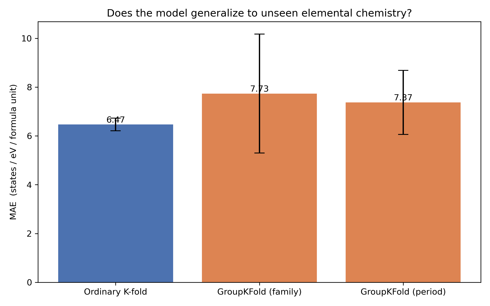

# DOS(E_F) as a DFT Proxy for Superconducting Tendency

**Scientific question:** Can compositional (MAGPIE) descriptors predict a material's density of states at the Fermi level, DOS(E_F) — a cheap, DFT-derived pre-screening signal for conventional electron-phonon superconductivity — and does that prediction generalize to unseen elemental chemistries rather than just interpolating within familiar ones?

DOS(E_F) only has a clear physical meaning for metals (band gap = 0). It enters directly into the McMillan/Allen-Dynes picture of conventional superconductivity: the electron-phonon coupling constant λ scales with N(E_F), so a large DOS(E_F) is one factor (not a sufficient one — λ also depends on phonon frequencies and the electron-phonon matrix element) that makes a material a better *candidate* for further electron-phonon coupling calculations.

## Dataset

Source: [Materials Project](https://next-gen.materialsproject.org/) — electronic structure / density-of-states API endpoint (`mp-api` client).

- Citation: A. Jain et al., "Commentary: The Materials Project: A materials genome approach to accelerating materials innovation," *APL Materials* 1, 011002 (2013). https://doi.org/10.1063/1.4812323
- Access: free API key required. Register at https://next-gen.materialsproject.org/api to obtain one.
- Query filters: `theoretical=False` (experimentally observed, ICSD-matched compounds) and `band_gap == 0` (metals, where DOS(E_F) is physically meaningful).

## Setup

```bash
conda create -n dos-ef python=3.11
conda activate dos-ef
pip install -r requirements.txt
```

**API key:**
1. Get a free key at https://next-gen.materialsproject.org/api
2. Create a file named `.env` in this notebook's directory containing:
   ```
   MP_API_KEY=your_key_here
   ```
3. `.env` is already listed in `.gitignore` — it will not be committed. See `.env.example` for the expected variable name.

The notebook loads the key via `load_dotenv()`; it is never hardcoded in any cell.

## Running the notebook

This project is a single notebook: `dos_ef_superconductor_screening_7.ipynb`. Run all cells top to bottom (Kernel → Restart & Run All):

1. **Part 1 — Setup:** imports, load API key from `.env`
2. **Part 2 — Query experimentally observed metals:** Materials Project summary search, `theoretical=False`, `band_gap == 0`
3. **Part 3 — Deduplicate** to the lowest-energy polymorph per unique composition
4. **Part 4 — Elemental family and period labels**
5. **Part 5 — Stratified, capped sample** across (family × crystal system)
6. **Part 6 — Fetch DOS objects** and extract DOS(E_F) by interpolation at the Fermi energy
7. **Part 7 — Featurization:** MAGPIE compositional descriptors (via `matminer`) + one-hot crystal system
8. **Part 8 — Random Forest baseline** + `GroupKFold` cross-validation (grouped by family and by period)
9. **Part 9 — Visualize** the CV comparison (bar chart)
10. **Part 10 — Held-out 80/20 train/test split:** parity plot + train-vs-test RMSE, to check for plain overfitting independent of the grouped-CV question
11. **Part 11 — Lasso feature selection:** which MAGPIE/crystal-system descriptors carry predictive weight
12. **Part 12 (optional) — DOS(E_F) by crystal system:** log-scaled violin plot

Raw query results are cached to `metals_query_cache.pkl` after the first run so re-running the notebook doesn't re-hit the Materials Project API. Delete this file to force a fresh query (e.g. after changing filter criteria).

> **Note:** this notebook was not executed in the authoring environment (no network access to the Materials Project API there). Run it locally or on a machine with internet access and a valid API key.

## Key results

The main diagnostic (Parts 8–9) compares ordinary K-fold cross-validation against `GroupKFold` grouped by elemental family and by periodic row — this is the test of whether the Random Forest is learning a genuinely transferable structure-property relationship or just interpolating within elemental families it has already seen.



*Figure 1. Cross-validated MAE for DOS(E_F) under three fold schemes. MAE rises from 6.47 (ordinary K-fold) to 7.73 (grouped by family) and 7.37 (grouped by period), with wide error bars on both grouped schemes — the model performs noticeably worse, and less consistently, when it has to extrapolate to elemental chemistries it hasn't seen before, rather than just interpolating within familiar ones.*

Part 11's Lasso feature-importance plot then narrows the full MAGPIE + crystal-system descriptor set down to the subset that actually carries predictive weight for DOS(E_F).


DOS(E_F) is a *screening* proxy, not a substitute for a full superconductivity prediction: high-scoring candidates from this pipeline are best treated as a shortlist for follow-up electron-phonon coupling calculations (e.g. DFPT/EPW), not as final T_c predictions.

## Requirements

- Python packages: `mp-api`, `pymatgen`, `matminer`, `scikit-learn`, `pandas`, `numpy`, `matplotlib`, `seaborn`, `tqdm`, `python-dotenv`
- A free Materials Project API key
- Internet access to `api.materialsproject.org`
